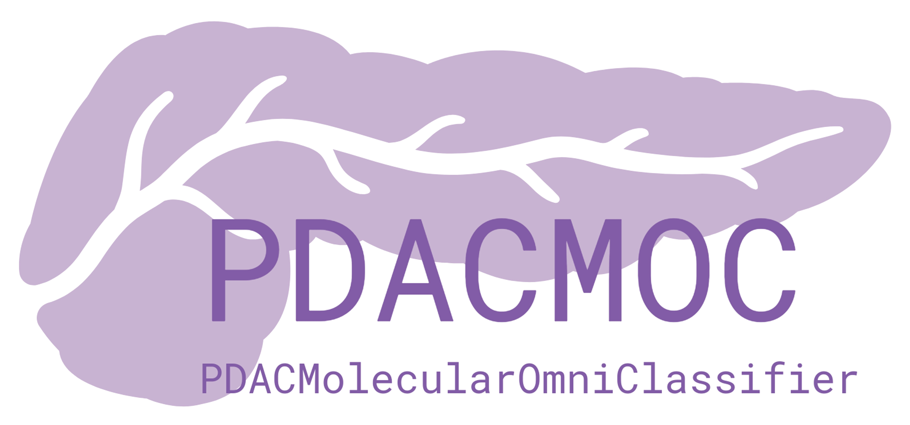
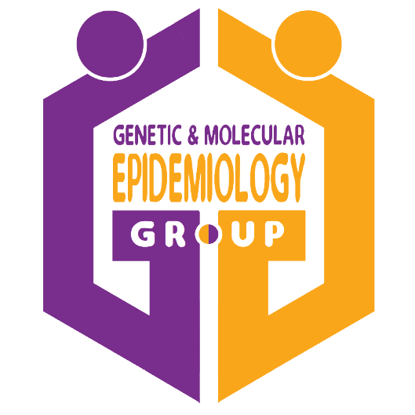

<p align="center">
  
</p>
<p align="center">
  
</p>

# PDACMOC

## PDACMolecularOmniClassifier

This package classifies tumor samples according to several molecular classifiers available using different Machine Learning (ML) approaches. It classifies both tumor and stroma fractions. To classify stroma compartment, it first makes a virtual microdissection through the `ADVOCATE` package.

### Classifiers available for tumor fractions:
1. Collisson et al., 2011.
2. Moffitt et al., 2015.
3. Bailey et al., 2016.
4. Puleo et al., 2018.
5. Chan-Seng-Yue et al., 2020.
6. PDAConsensus (following the methodology of Kamoun et al., 2020).

### Classifiers available for stroma fractions:
1. Moffitt et al., 2016.
2. Maurer et al., 2019.
3. PDAConsensus (following the methodology of Kamoun et al., 2020).

### Details
The package has been built for Linux (Ubuntu 22.04.3 LTS).

It contains the following files:
- `inst`:
  - `examples`: it contains a R script (`example.R`) with some examples.
  - `extdata`: it contains the `Certificate.pdf`.
  - `gene_signatures`: it contains a file with all the final genes included.
  - `graphs_and_tables`: it contains two figures that appear in the Shiny app.
  - `logos`: it contains some institutional logos.
  - `models`: it contains ML models saved as pickle format.
  - `packages`: it contains a compressed file (`ADVOCATE_0.1.0.tar.gz`) used to install ADVOCATE package.
  - `saved_workspaces`: it contains the workspaces generated with the example script.
  - `training_data`: it contains several files used by the classifiers.
- `man`: it contains the R markdown files produced automatically by devtools::document() using roxygen2 comments.
- `R`: it contains the different functions of the package.
- `DESCRIPTION`: description file.
- `license.txt`: license file.
- `NAMESPACE`: namespace file produced automatically by devtools::document() using roxygen2 comments.
- `PDACMOC.Rproj`: R project file.
- `README.md`: readme markdown file.
- `README.Rd`: readme R markdown file.
- `README.pdf`: readme pdf file.
- `.Rproj.user`: directory generated by RStudio that stores user-specific configurations and session states.
- `.Rbuildignore`: file used by R to exclude specific files and directories from package building.
- `.git`: directory for Git control version.
- `.gitattributes`: file used to manage attributes for paths in the repository, such as configuration for Git LFS.
- `.gitignore`: file used by Git to exclude specific files and directories from tracking and version control.

### Installation

To install the `PDACMOC` package, we recommend creating a Miniconda environment following these instructions:

```sh
# Download and uncompress the distribution file
wget https://github.com/pavillos/PDACMOC/releases/download/v.2.5.1/PDACMOC_2.5.1.tar.gz
tar -xvzf PDACMOC_2.5.1.tar.gz

# Install Miniconda
wget https://repo.anaconda.com/miniconda/Miniconda3-latest-Linux-x86_64.sh
bash Miniconda3-latest-Linux-x86_64.sh
rm Miniconda3-latest-Linux-x86_64.sh

# Close and open terminal

# Update conda
conda update conda

# Create conda environment
conda create -n PDACMOC

# Activate conda environment
conda activate PDACMOC

# Add conda-forge and bioconda channels
conda config --env --add channels conda-forge
conda config --env --add channels bioconda

# Install Python
conda install python=3.11.4

# Install Python modules
pip3 install numpy pandas pickle-mixin scikit-learn==1.3.1

# Install R
conda install -c conda-forge r-base=4.3.2

# Install libuv, libcurl, and libxml2
conda install -c conda-forge libuv
conda install -c conda-forge libcurl
conda install -c conda-forge libxml2

# Change PKG_CONFIG_PATH
# change path to your miniconda3 environment
export PKG_CONFIG_PATH="/home/pvilloslada/Software/miniconda3/envs/PDACMOC/lib/pkgconfig/:$PKG_CONFIG_PATH"

# Open R
R
```

```r
# Install R packages
options(repos = c(CRAN = 'https://cloud.r-project.org/'))
install.packages(c('BiocManager', 'doMC', 'dplyr', 'DT', 'foreach',
                   'iterators', 'mclust', 'plyr', 'reticulate', 'scales',
                   'shiny', 'shinydashboard', 'shinyjs', 'shinythemes'))
BiocManager::install(c('AnnotationDbi', 'DESeq2', 'org.Hs.eg.db', 'sva'))

# Close R
q()
```

```sh
# Install ADVOCATE
R CMD INSTALL ./PDACMOC/inst/packages/ADVOCATE_0.1.0.tar.gz

# Install PDACMOC
R CMD INSTALL ./PDACMOC_2.5.1.tar.gz

# Open R
R
```

```r
# Check if PDACMOC can be loaded
library(PDACMOC)

# Close R
q()
```

### Shiny app instructions

To run the program online:
1. Connect to server.
2. Upload a tsv file with genes in rows and samples in columns (max. 1GB).
3. Select if you want to apply or not batch correction.
4. Select the gene ID type.
5. Select one or more tumor classifiers.
6. Select if you want to include or not stroma classification.
7. If you want to include stroma classification, select one or more stroma classifiers.
8. Press 'Run classification' and wait about 15-20 minutes.
9. If you want to upload another tsv file press 'Reset app'.

After the process you will find the following:
1. Table of tumor/stroma proportions. 'E' stands for epithelium, 'S' stands for stroma, and 'O' stands for others. 'conf' refers to 95% confidence intervals.
2. Up to 6 tables of tumor classification.
3. Up to 6 summary tables of tumor classification.
4. Up to 3 tables of stroma classification.
5. Up to 3 summary tables of stroma classification.

### Keywords

PDAC, consensus molecular classifier, transcriptomics, Machine Learning, translational medicine, personalized medicine.

### Authors

**Pablo Villoslada-Blanco**

Genetic & Molecular Epidemiology Group (GMEG)

Spanish National Cancer Research Centre (CNIO)

**Lola Alonso**

Genetic & Molecular Epidemiology Group (GMEG)

Spanish National Cancer Research Centre (CNIO)

**Sergio Sabroso-Lasa**

Genetic & Molecular Epidemiology Group (GMEG)

Spanish National Cancer Research Centre (CNIO)

**Miguel Maquedano**

Bioinformatics Unit

Spanish National Cancer Research Centre (CNIO)

**Lidia Estudillo**

Genetic & Molecular Epidemiology Group (GMEG)

Spanish National Cancer Research Centre (CNIO)

**Francisco X Real**

Epithelial Carcinogenesis Group

Spanish National Cancer Research Centre (CNIO)

**Evangelina López de Maturana**

Genetic & Molecular Epidemiology Group (GMEG)

Spanish National Cancer Research Centre (CNIO)

**Núria Malats**

Genetic & Molecular Epidemiology Group (GMEG)

Spanish National Cancer Research Centre (CNIO)

### References

1. Collisson, E., Sadanandam, A., Olson, P. et al. Subtypes of pancreatic ductal adenocarcinoma and their differing responses to therapy. Nat Med 17, 500–503 (2011). [https://doi.org/10.1038/nm.2344](https://doi.org/10.1038/nm.2344)
2. Moffitt, R., Marayati, R., Flate, E. et al. Virtual microdissection identifies distinct tumor- and stroma-specific subtypes of pancreatic ductal adenocarcinoma. Nat Genet 47, 1168–1178 (2015). [https://doi.org/10.1038/ng.3398](https://doi.org/10.1038/ng.3398)
3. Rashid, N. U., Peng, X. L., Jin, C., Moffitt, R. A., Volmar, K. E., Belt, B. A., Panni, R. Z., Nywening, T. M., Herrera, S. G., Moore, K. J., Hennessey, S. G., Morrison, A. B., Kawalerski, R., Nayyar, A., Chang, A. E., Schmidt, B., Kim, H. J., Linehan, D. C., & Yeh, J. J. (2020). Purity Independent Subtyping of Tumors (PurIST), A Clinically Robust, Single-sample Classifier for Tumor Subtyping in Pancreatic Cancer. Clinical cancer research : an official journal of the American Association for Cancer Research, 26(1), 82–92. [https://doi.org/10.1158/1078-0432.CCR-19-1467](https://doi.org/10.1158/1078-0432.CCR-19-1467)
4. Bailey, P., Chang, D., Nones, K. et al. Genomic analyses identify molecular subtypes of pancreatic cancer. Nature 531, 47–52 (2016). [https://doi.org/10.1038/nature16965](https://doi.org/10.1038/nature16965)
5. Puleo, F., Nicolle, R., Blum, Y., Cros, J., Marisa, L., Demetter, P., Quertinmont, E., Svrcek, M., Elarouci, N., Iovanna, J., Franchimont, D., Verset, L., Galdon, M. G., Devière, J., de Reyniès, A., Laurent-Puig, P., Van Laethem, J. L., Bachet, J. B., & Maréchal, R. (2018). Stratification of Pancreatic Ductal Adenocarcinomas Based on Tumor and Microenvironment Features. Gastroenterology, 155(6), 1999–2013.e3. [https://doi.org/10.1053/j.gastro.2018.08.033](https://doi.org/10.1053/j.gastro.2018.08.033)
6. Chan-Seng-Yue, M., Kim, J.C., Wilson, G.W. et al. Transcription phenotypes of pancreatic cancer are driven by genomic events during tumor evolution. Nat Genet 52, 231–240 (2020). [https://doi.org/10.1038/s41588-019-0566-9](https://doi.org/10.1038/s41588-019-0566-9)
7. Maurer, C., Holmstrom, S. R., He, J., Laise, P., Su, T., Ahmed, A., Hibshoosh, H., Chabot, J. A., Oberstein, P. E., Sepulveda, A. R., Genkinger, J. M., Zhang, J., Iuga, A. C., Bansal, M., Califano, A., & Olive, K. P. (2019). Experimental microdissection enables functional harmonisation of pancreatic cancer subtypes. Gut, 68(6), 1034–1043. [https://doi.org/10.1136/gutjnl-2018-317706](https://doi.org/10.1136/gutjnl-2018-317706)
8. Kamoun, A., de Reyniès, A., Allory, Y., Sjödahl, G., Robertson, A. G., Seiler, R., Hoadley, K. A., Groeneveld, C. S., Al-Ahmadie, H., Choi, W., Castro, M. A. A., Fontugne, J., Eriksson, P., Mo, Q., Kardos, J., Zlotta, A., Hartmann, A., Dinney, C. P., Bellmunt, J., Powles, T., … Bladder Cancer Molecular Taxonomy Group (2020). A Consensus Molecular Classification of Muscle-invasive Bladder Cancer. European urology, 77(4), 420–433. [https://doi.org/10.1016/j.eururo.2019.09.006](https://doi.org/10.1016/j.eururo.2019.09.006)

### Examples

```r
library(PDACMOC)

file1 <- system.file('examples', 'example.R', package = 'PDACMOC')
dir <- file.path(dirname(file1), '../saved_workspaces/example.RData')
#load(dir)
rm(file1)

# change path to your miniconda3 environment
reticulate::use_python("~/Software/miniconda3/envs/PDACMOC/bin/python3.11", required = TRUE)

file2 <- system.file('training_data', 'all_datasets_corrected.csv', package = 'PDACMOC')

samples <- read.csv(file2, row.names = 1, check.names = FALSE)
rm(file2)

new_samples <- PDACMOC:::import.and.normalize(samples, batch = FALSE, gene_id = 'EnsemblID')

results_collisson <- PDACMOC:::collisson.classify(new_samples)

results_moffitt <- PDACMOC:::moffitt.classify(new_samples)

results_bailey <- PDACMOC:::bailey.classify(new_samples)

results_puleo <- PDACMOC:::puleo.classify(new_samples)

results_chan <- PDACMOC:::chan.classify(new_samples)

results_consensus <- PDACMOC:::PDAConsensus.classify(new_samples)

vm_result <- PDACMOC:::virtual.microdissect(new_samples)

results_stroma_moffitt <- PDACMOC:::stroma.moffitt.classify(vm_result$vm_S)

results_stroma_maurer <- PDACMOC:::stroma.maurer.classify(vm_result$vm_S)

results_stroma_consensus <- PDACMOC:::stroma.PDAConsensus.classify(vm_result$vm_S)

classification_tumor <- PDACMOC:::omni.classify(samples, batch = FALSE, gene_id = 'EnsemblID',
                                                  classifier = c('Collisson', 'Moffitt', 'Bailey',
                                                                 'Puleo', 'Chan-Seng-Yue', 'PDAConsensus'))

classification_all <- PDACMOC:::omni.classify(samples, batch = FALSE, gene_id = 'EnsemblID',
                                              classifier = c('Collisson', 'Moffitt', 'Bailey',
                                                             'Puleo', 'Chan-Seng-Yue', 'PDAConsensus'),
                                              stroma = TRUE,
                                              stroma_classifier = c('Moffitt',
                                                                    'Maurer',
                                                                    'PDAConsensus'))
  
# change path to your browser
options(browser = '/usr/bin/firefox')
shinyjs::useShinyjs()
runPDACMOC()

#save.image(dir)
```

<p align="center">
  
  
</p>
