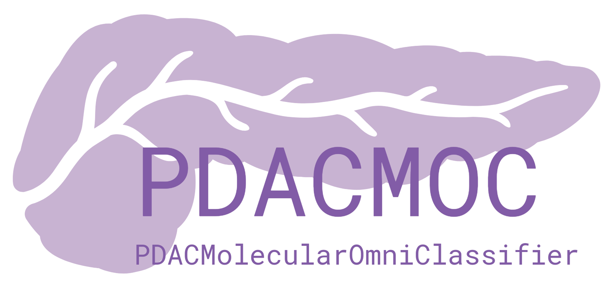

<p align="center">
  
</p>
<p align="center">
  
</p>

# PDACMOC

## PDACMolecularOmniClassifier

[](https://doi.org/10.1186/s13073-025-01568-9)
[](https://doi.org/10.5281/zenodo.17019896)
[](https://doi.org/10.1101/2025.03.06.641837)

[](https://github.com/pavillos/PDACMOC/releases/latest)
[](https://github.com/pavillos/PDACMOC/releases)
[](https://github.com/pavillos/PDACMOC/releases/latest)
[](https://doi.org/10.5281/zenodo.17019896)
[](https://doi.org/10.5281/zenodo.17019896)
[](https://doi.org/10.1186/s13073-025-01568-9)
[](https://github.com/pavillos/PDACMOC)
[](https://github.com/pavillos/PDACMOC)
[](https://pdacmoc.cnio.es)
[](https://pdacmoc.cnio.es)
[](LICENSE)

This package classifies tumor samples according to several molecular classifiers available using different Machine Learning (ML) approaches. It classifies both tumor and stroma fractions. To classify stroma compartment, it first makes a virtual microdissection through the `ADVOCATE` package.

See [NEWS.md](NEWS.md) for the changes in each version.

### Classifiers available for tumor fractions:
1. Collisson et al., 2011.
2. Moffitt et al., 2015.
3. Bailey et al., 2016.
4. Puleo et al., 2018.
5. Chan-Seng-Yue et al., 2020.
6. PDAConsensus (following the methodology of Kamoun et al., 2020).

### Classifiers available for stroma fractions:
1. Moffitt et al., 2016.
2. Maurer et al., 2019.
3. PDAConsensus (following the methodology of Kamoun et al., 2020).

### Details
The package has been built for Linux (Ubuntu 22.04.3 LTS).

It contains the following files:
- `install`: conda environment and installer (see Installation).
- `inst`:
  - `examples`: it contains a R script (`example.R`) with some examples.
  - `extdata`: it contains the `Certificate.pdf`.
  - `gene_signatures`: it contains a file with all the final genes included.
  - `graphs_and_tables`: it contains two figures that appear in the Shiny app.
  - `logos`: it contains some institutional logos.
  - `models`: it contains ML models saved as pickle format.
  - `packages`: it contains a compressed file (`ADVOCATE_0.1.0.1.tar.gz`) used to install ADVOCATE package.
  - `saved_workspaces`: it contains the workspaces generated with the example script.
  - `training_data`: it contains several files used by the classifiers.
- `man`: it contains the R markdown files produced automatically by devtools::document() using roxygen2 comments.
- `R`: it contains the different functions of the package.
- `DESCRIPTION`: description file.
- `license.txt`: license file.
- `NAMESPACE`: namespace file produced automatically by devtools::document() using roxygen2 comments.
- `PDACMOC.Rproj`: R project file.
- `README.md`: readme markdown file.
- `README.Rd`: readme R markdown file.
- `README.pdf`: readme pdf file.
- `.Rproj.user`: directory generated by RStudio that stores user-specific configurations and session states.
- `.Rbuildignore`: file used by R to exclude specific files and directories from package building.
- `.git`: directory for Git control version.
- `.gitattributes`: file used to manage attributes for paths in the repository, such as configuration for Git LFS.
- `.gitignore`: file used by Git to exclude specific files and directories from tracking and version control.

### Installation

PDACMOC runs on Linux and needs [conda](https://conda-forge.org/download/) (Miniforge or Miniconda). The installer creates a conda environment called `pdacmoc` with R, Python and all the dependencies:

```sh
wget https://github.com/pavillos/PDACMOC/releases/download/v.2.6.0/PDACMOC_2.6.0.tar.gz
tar -xzf PDACMOC_2.6.0.tar.gz
bash PDACMOC/install/install.sh PDACMOC_2.6.0.tar.gz
```

To use it, run `conda activate pdacmoc`, open R and load the package, pointing `reticulate` to the Python of the environment (the installer prints its path):

```r
reticulate::use_python('~/miniconda3/envs/pdacmoc/bin/python', required = TRUE)
library(PDACMOC)
```

The environment pins scikit-learn 1.3.1 and org.Hs.eg.db 3.18.0, the versions the published models were built with: newer versions change the classification. Do not update them by hand.

### Shiny app instructions

Use it online at [https://pdacmoc.cnio.es/](https://pdacmoc.cnio.es/), or on your computer with `runPDACMOC()`.

1. Upload a .tsv or .csv file of raw counts with genes in rows and samples in columns (max. 1GB).
2. Choose batch correction, the gene ID type, the tumor classifiers and, optionally, the stroma classifiers.
3. Press 'Run classification'. The Run card shows the progress, the estimated time and any message about your file; you can cancel at any time.
4. When it finishes, the app opens the results. Press 'New classification' to classify another file.

After the process you will find the following:
1. In the Results tab, one table per classifier with the predicted subtype (in the colours used in the paper), its probability and a flag when the probability is below the threshold of that classifier (low confidence). *PDAConsensus* tables also show the NonClassicalScore or ActivatedECMScore.
2. In the Results tab, the table of tumor/stroma proportions (only with stroma classification). 'E' stands for epithelium, 'S' stands for stroma, and 'O' stands for others. 'conf' refers to 95% confidence intervals.
3. In the Summary tab, the number of samples assigned to each subtype for every classifier.
4. In the Performance tab, the published balanced accuracy of every classifier.

### Classifying your own files from R

`read.counts()` reads a file of raw counts the same way the Shiny app does: it accepts .tsv, .csv and .txt files, detects the separator and averages rows with duplicated gene IDs.

```r
library(PDACMOC)
counts <- read.counts('my_counts.csv')
classification <- omni.classify(counts, gene_id = 'EnsemblID')
```

### Keywords

PDAC, consensus molecular classifier, transcriptomics, Machine Learning, translational medicine, personalized medicine.

### Authors

**Pablo Villoslada-Blanco**

Genetic & Molecular Epidemiology Group (GMEG)

Spanish National Cancer Research Centre (CNIO)

**Lola Alonso**

Genetic & Molecular Epidemiology Group (GMEG)

Spanish National Cancer Research Centre (CNIO)

**Sergio Sabroso-Lasa**

Genetic & Molecular Epidemiology Group (GMEG)

Spanish National Cancer Research Centre (CNIO)

**Miguel Maquedano**

Bioinformatics Unit

Spanish National Cancer Research Centre (CNIO)

**Lidia Estudillo**

Genetic & Molecular Epidemiology Group (GMEG)

Spanish National Cancer Research Centre (CNIO)

**Francisco X Real**

Epithelial Carcinogenesis Group

Spanish National Cancer Research Centre (CNIO)

**Evangelina López de Maturana**

Genetic & Molecular Epidemiology Group (GMEG)

Spanish National Cancer Research Centre (CNIO)

**Núria Malats**

Genetic & Molecular Epidemiology Group (GMEG)

Spanish National Cancer Research Centre (CNIO)

### References

1. Collisson, E., Sadanandam, A., Olson, P. et al. Subtypes of pancreatic ductal adenocarcinoma and their differing responses to therapy. Nat Med 17, 500–503 (2011). [https://doi.org/10.1038/nm.2344](https://doi.org/10.1038/nm.2344)
2. Moffitt, R., Marayati, R., Flate, E. et al. Virtual microdissection identifies distinct tumor- and stroma-specific subtypes of pancreatic ductal adenocarcinoma. Nat Genet 47, 1168–1178 (2015). [https://doi.org/10.1038/ng.3398](https://doi.org/10.1038/ng.3398)
3. Rashid, N. U., Peng, X. L., Jin, C., Moffitt, R. A., Volmar, K. E., Belt, B. A., Panni, R. Z., Nywening, T. M., Herrera, S. G., Moore, K. J., Hennessey, S. G., Morrison, A. B., Kawalerski, R., Nayyar, A., Chang, A. E., Schmidt, B., Kim, H. J., Linehan, D. C., & Yeh, J. J. (2020). Purity Independent Subtyping of Tumors (PurIST), A Clinically Robust, Single-sample Classifier for Tumor Subtyping in Pancreatic Cancer. Clinical cancer research : an official journal of the American Association for Cancer Research, 26(1), 82–92. [https://doi.org/10.1158/1078-0432.CCR-19-1467](https://doi.org/10.1158/1078-0432.CCR-19-1467)
4. Bailey, P., Chang, D., Nones, K. et al. Genomic analyses identify molecular subtypes of pancreatic cancer. Nature 531, 47–52 (2016). [https://doi.org/10.1038/nature16965](https://doi.org/10.1038/nature16965)
5. Puleo, F., Nicolle, R., Blum, Y., Cros, J., Marisa, L., Demetter, P., Quertinmont, E., Svrcek, M., Elarouci, N., Iovanna, J., Franchimont, D., Verset, L., Galdon, M. G., Devière, J., de Reyniès, A., Laurent-Puig, P., Van Laethem, J. L., Bachet, J. B., & Maréchal, R. (2018). Stratification of Pancreatic Ductal Adenocarcinomas Based on Tumor and Microenvironment Features. Gastroenterology, 155(6), 1999–2013.e3. [https://doi.org/10.1053/j.gastro.2018.08.033](https://doi.org/10.1053/j.gastro.2018.08.033)
6. Chan-Seng-Yue, M., Kim, J.C., Wilson, G.W. et al. Transcription phenotypes of pancreatic cancer are driven by genomic events during tumor evolution. Nat Genet 52, 231–240 (2020). [https://doi.org/10.1038/s41588-019-0566-9](https://doi.org/10.1038/s41588-019-0566-9)
7. Maurer, C., Holmstrom, S. R., He, J., Laise, P., Su, T., Ahmed, A., Hibshoosh, H., Chabot, J. A., Oberstein, P. E., Sepulveda, A. R., Genkinger, J. M., Zhang, J., Iuga, A. C., Bansal, M., Califano, A., & Olive, K. P. (2019). Experimental microdissection enables functional harmonisation of pancreatic cancer subtypes. Gut, 68(6), 1034–1043. [https://doi.org/10.1136/gutjnl-2018-317706](https://doi.org/10.1136/gutjnl-2018-317706)
8. Kamoun, A., de Reyniès, A., Allory, Y., Sjödahl, G., Robertson, A. G., Seiler, R., Hoadley, K. A., Groeneveld, C. S., Al-Ahmadie, H., Choi, W., Castro, M. A. A., Fontugne, J., Eriksson, P., Mo, Q., Kardos, J., Zlotta, A., Hartmann, A., Dinney, C. P., Bellmunt, J., Powles, T., … Bladder Cancer Molecular Taxonomy Group (2020). A Consensus Molecular Classification of Muscle-invasive Bladder Cancer. European urology, 77(4), 420–433. [https://doi.org/10.1016/j.eururo.2019.09.006](https://doi.org/10.1016/j.eururo.2019.09.006)

### Examples

```r
library(PDACMOC)

file1 <- system.file('examples', 'example.R', package = 'PDACMOC')
dir <- file.path(dirname(file1), '../saved_workspaces/example.RData')
#load(dir)
rm(file1)

# Python of the pdacmoc environment (printed by the installer)
reticulate::use_python('~/miniconda3/envs/pdacmoc/bin/python', required = TRUE)

file2 <- system.file('training_data', 'all_datasets_corrected.csv', package = 'PDACMOC')

samples <- read.csv(file2, row.names = 1, check.names = FALSE)
rm(file2)

new_samples <- PDACMOC:::import.and.normalize(samples, batch = FALSE, gene_id = 'EnsemblID')

results_collisson <- PDACMOC:::collisson.classify(new_samples)

results_moffitt <- PDACMOC:::moffitt.classify(new_samples)

results_bailey <- PDACMOC:::bailey.classify(new_samples)

results_puleo <- PDACMOC:::puleo.classify(new_samples)

results_chan <- PDACMOC:::chan.classify(new_samples)

results_consensus <- PDACMOC:::PDAConsensus.classify(new_samples)

vm_result <- PDACMOC:::virtual.microdissect(new_samples)

results_stroma_moffitt <- PDACMOC:::stroma.moffitt.classify(vm_result$vm_S)

results_stroma_maurer <- PDACMOC:::stroma.maurer.classify(vm_result$vm_S)

results_stroma_consensus <- PDACMOC:::stroma.PDAConsensus.classify(vm_result$vm_S)

classification_tumor <- PDACMOC:::omni.classify(samples, batch = FALSE, gene_id = 'EnsemblID',
                                                  classifier = c('Collisson', 'Moffitt', 'Bailey',
                                                                 'Puleo', 'Chan-Seng-Yue', 'PDAConsensus'))

classification_all <- PDACMOC:::omni.classify(samples, batch = FALSE, gene_id = 'EnsemblID',
                                              classifier = c('Collisson', 'Moffitt', 'Bailey',
                                                             'Puleo', 'Chan-Seng-Yue', 'PDAConsensus'),
                                              stroma = TRUE,
                                              stroma_classifier = c('Moffitt',
                                                                    'Maurer',
                                                                    'PDAConsensus'))
  
# change path to your browser
options(browser = '/usr/bin/firefox')
shinyjs::useShinyjs()
runPDACMOC()

#save.image(dir)
```

<p align="center">
  
  
</p>
